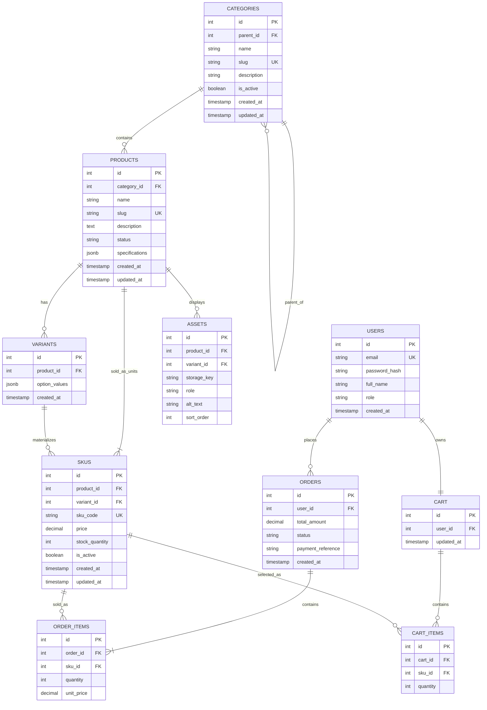

# Sprint 2: Catalog Data Foundation

**Course:** E-Commerce Software Development Life Cycle (SDLC)
**Document Version:** 1.0
**Status:** Complete (fill in the `TODO` evidence fields before submission)

---

## Section 1: Sprint Goal & Scope Boundary

### Sprint Goal
Given a product catalog administrator, the system must persist **categories, products, variants, and SKUs** without losing identity, relationship, price, or inventory meaning. This sprint turns the Sprint 1 architecture and the Week 3 catalog model into a reliable database foundation that Sprint 3 (specifications, assets, public catalog reads) and the later cart/checkout can consume.

### In Scope
| Area | Delivered in Sprint 2 |
|---|---|
| Categories | Tree with stable ids and unique slugs; create, update, deactivate, list; cycle prevention |
| Products | Create/edit with name, slug, description, status, canonical category |
| Variants & SKUs | Valid variant combinations only; SKUs with unique code, price, stock, active flag |
| Administration | Authenticated, role-checked CRUD routes for the entities above |
| Integrity | Constraints, migrations, seed data, automated model/validation/authorization tests |

### Out of Scope (Sprint 3 or later)
Dynamic specification editing, asset upload, public catalog search, publication workflows, payment gateway integration, order placement, shipping integration, and the complete shopper checkout flow. The `assets` table and `products.specifications` column exist in the schema as **planned structure only**; no API or UI for them is claimed as Sprint 2 functionality.

### Sprint Timeline (15 days)
| Days | Focus | Checkpoint |
|---|---|---|
| 1–3 | Repository setup and migrations | Stack runs locally; migration creates core tables |
| 4–6 | Categories and products | Category tree and product CRUD work with constraints |
| 7–9 | Variants and SKUs | SKU uniqueness, price, stock, valid combinations enforced |
| 10–12 | Administration and seed data | Protected admin routes and reproducible sample data |
| 13–14 | Tests and documentation | Model, validation, authorization tests; ERD and setup evidence |
| 15 | Sprint review | Demo, peer review, backlog refinement, Sprint 3 hand-off |

---

## Section 2: Reused and Changed Sprint 1 Decisions

### Reused Unchanged
| Sprint 1 Decision | How Sprint 2 Uses It |
|---|---|
| Single-vendor, multi-customer MVP | One catalog, one admin role; no vendor ownership columns |
| React + Vite / Node.js + Express | Admin API implemented in Express; no frontend work this sprint |
| PostgreSQL (relational, ACID) | All integrity rules enforced by the database, not only by API validation |
| bcrypt + JWT authentication | Reused to protect admin routes; `users.role` distinguishes `admin` from `customer` |
| Redis (optional) | Not used in Sprint 2; remains optional for Sprint 3 public catalog caching |
| Order item price snapshot (`unit_price`) | Kept; now snapshots the SKU price at purchase time |

### Changed (with justification)
| Sprint 1 Element | Sprint 2 Change | Reason |
|---|---|---|
| `PRODUCTS.price`, `PRODUCTS.stock_quantity`, `PRODUCTS.sku` | **Moved to `SKUS`** | Sprint 1 treated a product as a single sellable item. Real apparel needs size/color variants, each with its own code, price, and stock (CAT03). |
| `ORDER_ITEMS.product_id` | Replaced by `sku_id` | An order must record exactly which sellable unit was bought. `product_id` is reachable via the SKU. |
| `CART_ITEMS.product_id` | Replaced by `sku_id` | A cart holds sellable units, not abstract products (Sprint 3 consumes SKU identities). |
| `CATEGORIES` (flat) | Added `parent_id`, `is_active`, `updated_at` | CAT01 requires a tree with deactivation. |
| `PRODUCTS` | Added `slug`, `status`, `specifications`, `updated_at` | CAT02 and the Sprint 2 data model. |
| Entities `VARIANTS`, `SKUS`, `ASSETS` | **New** | Required catalog entities. |

Unchanged from Sprint 1: `USERS`, `ORDERS`, `CART` (fields and relationships).

---

## Section 3: Updated ERD and Data Dictionary

### Cardinality Summary
- **Categories → Categories (parent):** 1:N (a category has many children; each has at most one parent)
- **Categories → Products:** 1:N (each product has exactly one canonical category)
- **Products → Variants:** 1:N (zero or more variants per product)
- **Products → SKUs:** 1:N (one or more SKUs per sellable product)
- **Variants → SKUs:** 1:N (a variant may have more than one SKU, e.g. different packaging); SKU's `variant_id` is optional for products without variants
- **Products → Assets:** 1:N (planned, Sprint 3)
- **SKUs → Cart_Items:** 1:N (a SKU can be in many carts)
- **SKUs → Order_Items:** 1:N (a SKU can be sold in many orders)
- **Users → Orders / Users → Cart / Orders → Order_Items / Cart → Cart_Items:** unchanged from Sprint 1

### Mermaid ERD



### Data Dictionary

**CATEGORIES**
| Column | Type | Constraints |
|---|---|---|
| id | SERIAL | PK |
| parent_id | INT | FK → `categories.id`, NULL for root categories |
| name | VARCHAR(100) | NOT NULL |
| slug | VARCHAR(120) | NOT NULL, UNIQUE |
| description | TEXT | NULL |
| is_active | BOOLEAN | NOT NULL, DEFAULT true |
| created_at / updated_at | TIMESTAMPTZ | NOT NULL, DEFAULT now() |
| (table check) | | `CHECK (parent_id <> id)`; deeper cycles blocked by trigger (Section 5) |

**PRODUCTS**
| Column | Type | Constraints |
|---|---|---|
| id | SERIAL | PK |
| category_id | INT | NOT NULL, FK → `categories.id` |
| name | VARCHAR(200) | NOT NULL |
| slug | VARCHAR(220) | NOT NULL, UNIQUE |
| description | TEXT | NULL |
| status | VARCHAR(20) | NOT NULL, DEFAULT `draft`, CHECK in (`draft`, `active`, `archived`) |
| specifications | JSONB | NOT NULL, DEFAULT `'{}'`, validation rule below |
| created_at / updated_at | TIMESTAMPTZ | NOT NULL, DEFAULT now() |

**Specification validation rule (planned for Sprint 3 editing):** `specifications` must be a flat JSON object with at most 50 keys; keys match `^[a-z][a-z0-9_]{0,49}$`; values are strings (≤ 200 chars), numbers, or booleans (no nested objects or arrays). Enforced by `CHECK (jsonb_typeof(specifications) = 'object')` in the database and by schema validation in the API layer.

**VARIANTS**
| Column | Type | Constraints |
|---|---|---|
| id | SERIAL | PK |
| product_id | INT | NOT NULL, FK → `products.id` |
| option_values | JSONB | NOT NULL, e.g. `{"color":"black","size":"M"}` |
| created_at | TIMESTAMPTZ | NOT NULL, DEFAULT now() |
| (table constraint) | | UNIQUE (`product_id`, `option_values`) |

**SKUS**
| Column | Type | Constraints |
|---|---|---|
| id | SERIAL | PK |
| product_id | INT | NOT NULL, FK → `products.id` |
| variant_id | INT | NULL (NULL = product has no variants), FK → `variants.id` |
| sku_code | VARCHAR(64) | NOT NULL, UNIQUE |
| price | NUMERIC(12,2) | NOT NULL, `CHECK (price >= 0)` |
| stock_quantity | INT | NOT NULL, DEFAULT 0, `CHECK (stock_quantity >= 0)` |
| is_active | BOOLEAN | NOT NULL, DEFAULT true |
| created_at / updated_at | TIMESTAMPTZ | NOT NULL, DEFAULT now() |

**ASSETS** (structure only; no upload in Sprint 2)
| Column | Type | Constraints |
|---|---|---|
| id | SERIAL | PK |
| product_id | INT | NOT NULL, FK → `products.id` |
| variant_id | INT | NULL, FK → `variants.id` |
| storage_key | VARCHAR(500) | NOT NULL |
| role | VARCHAR(30) | NOT NULL, CHECK in (`primary`, `gallery`, `swatch`) |
| alt_text | VARCHAR(255) | NULL |
| sort_order | INT | NOT NULL, DEFAULT 0 |

### Foreign Key Delete / Update Policies
All foreign keys use `ON UPDATE CASCADE` (ids are immutable in practice).

| Foreign Key | ON DELETE | Rationale |
|---|---|---|
| `categories.parent_id → categories.id` | RESTRICT | A category with children cannot be hard-deleted; deactivate instead |
| `products.category_id → categories.id` | RESTRICT | Never orphan products |
| `variants.product_id → products.id` | CASCADE | Variants have no meaning without their product |
| `skus.product_id → products.id` | RESTRICT | SKUs may be referenced by orders; deactivate instead of deleting |
| `skus.variant_id → variants.id` | RESTRICT | A variant with SKUs cannot be removed silently |
| `assets.product_id → products.id` | CASCADE | Assets belong to the product |
| `assets.variant_id → variants.id` | SET NULL | Asset falls back to product-level |
| `cart_items.sku_id → skus.id` | CASCADE | A cart line for a removed SKU is dropped (Sprint 3 will deactivate rather than delete) |
| `order_items.sku_id → skus.id` | RESTRICT | Order history must never lose its purchased unit |

### Money Representation
Prices use `NUMERIC(12,2)` (exact decimal), consistent with Sprint 1's `decimal` fields. No floating-point money is used anywhere. The API accepts and returns prices as decimal strings (e.g. `"1999.00"`) to avoid JavaScript float rounding.

---

## Section 4: Administration Route Table

Base path: `/api/v1/admin`. All routes require `Authorization: Bearer <JWT>` and a user whose `role = 'admin'`.

| Method | Route | Purpose |
|---|---|---|
| POST | `/api/v1/admin/categories` | Create a category |
| GET | `/api/v1/admin/categories` | Return the category tree |
| PATCH | `/api/v1/admin/categories/:id` | Update or deactivate a category |
| POST | `/api/v1/admin/products` | Create a draft product |
| GET | `/api/v1/admin/products` | List administrative product records (with variants and SKUs) |
| PATCH | `/api/v1/admin/products/:id` | Update product content or status |
| POST | `/api/v1/admin/products/:id/variants` | Add a valid variant combination |
| POST | `/api/v1/admin/products/:id/skus` | Add a validated SKU |
| PATCH | `/api/v1/admin/skus/:id` | Update price, stock, or active status |

### Consistent Error Response
```json
{
  "error": {
    "code": "DUPLICATE_SLUG",
    "message": "A product with slug 'classic-cotton-tshirt' already exists.",
    "details": [{ "field": "slug", "issue": "must be unique" }]
  }
}
```

| Status | Meaning | Example `code` |
|---|---|---|
| 400 | Malformed request | `INVALID_JSON` |
| 401 | Missing/invalid token | `UNAUTHENTICATED` |
| 403 | Authenticated but not admin | `FORBIDDEN` |
| 404 | Record not found | `NOT_FOUND` |
| 409 | Duplicate slug / SKU code, or business-rule conflict | `DUPLICATE_SLUG`, `DUPLICATE_SKU`, `CATEGORY_CYCLE` |
| 422 | Validation failure | `VALIDATION_FAILED`, `NEGATIVE_STOCK` |

Database unique-violation errors (PostgreSQL `23505`) are caught and mapped to `409`; the client never sees a server traceback.

### Endpoint Documentation

#### POST `/api/v1/admin/categories`
- **Request fields:** `name` (string, required), `slug` (string, required, unique), `parent_id` (int, optional), `description` (string, optional)
- **Success:** `201 Created`
- **Errors:** 401, 403, 409 (duplicate slug), 422 (missing name/slug, unknown parent)

```json
// Request
{ "name": "T-Shirts", "slug": "t-shirts", "parent_id": 1 }

// Response 201
{ "data": { "id": 2, "parent_id": 1, "name": "T-Shirts", "slug": "t-shirts", "is_active": true } }
```

#### GET `/api/v1/admin/categories`
- **Response:** `200 OK`, nested tree (children under `children`)
- **Errors:** 401, 403

```json
{ "data": [
  { "id": 1, "name": "Apparel", "slug": "apparel", "is_active": true,
    "children": [ { "id": 2, "name": "T-Shirts", "slug": "t-shirts", "is_active": true, "children": [] } ] }
] }
```

#### PATCH `/api/v1/admin/categories/:id`
- **Request fields (any):** `name`, `slug`, `parent_id`, `is_active`, `description`
- **Errors:** 401, 403, 404, 409 (duplicate slug, `CATEGORY_CYCLE`), 422

```json
// Request: moving Apparel under its own child
{ "parent_id": 2 }
// Response 409
{ "error": { "code": "CATEGORY_CYCLE", "message": "A category cannot become its own ancestor." } }
```

#### POST `/api/v1/admin/products`
- **Request fields:** `name` (required), `slug` (required, unique), `category_id` (required, must exist), `description` (optional). `status` is forced to `draft` on creation.
- **Success:** `201 Created`
- **Errors:** 401, 403, 409 (duplicate slug), 422

```json
// Request
{ "name": "Classic Cotton T-Shirt", "slug": "classic-cotton-tshirt", "category_id": 2,
  "description": "100% combed cotton, regular fit." }

// Response 201
{ "data": { "id": 1, "category_id": 2, "name": "Classic Cotton T-Shirt",
  "slug": "classic-cotton-tshirt", "status": "draft" } }
```

#### GET `/api/v1/admin/products`
- **Query params:** `status` (optional), `category_id` (optional), `page`, `page_size`
- **Response:** `200 OK` with products, nested `variants` and `skus`; includes drafts and inactive SKUs.

```json
{ "data": [ { "id": 1, "name": "Classic Cotton T-Shirt", "status": "draft",
  "variants": [ { "id": 1, "option_values": { "color": "black", "size": "M" } } ],
  "skus": [ { "id": 1, "sku_code": "TSH-BLK-M", "price": "1999.00", "stock_quantity": 25, "is_active": true } ] } ],
  "page": 1, "page_size": 20, "total": 1 }
```

#### PATCH `/api/v1/admin/products/:id`
- **Request fields (any):** `name`, `slug`, `description`, `category_id`, `status` (`draft` | `active` | `archived`)
- **Errors:** 401, 403, 404, 409 (duplicate slug), 422 (e.g. activating a product with no sellable SKU)

```json
// Request
{ "status": "active" }
// Response 422 (no sellable SKU yet)
{ "error": { "code": "NO_SELLABLE_SKU", "message": "A product needs at least one active SKU before it can be set to active." } }
```

#### POST `/api/v1/admin/products/:id/variants`
- **Request fields:** `option_values` (object, required, non-empty, flat string values)
- **Errors:** 401, 403, 404, 409 (this combination already exists), 422

```json
// Request
{ "option_values": { "color": "black", "size": "M" } }
// Response 201
{ "data": { "id": 1, "product_id": 1, "option_values": { "color": "black", "size": "M" } } }
```

#### POST `/api/v1/admin/products/:id/skus`
- **Request fields:** `sku_code` (required, unique), `price` (required, decimal string ≥ 0), `stock_quantity` (int ≥ 0, default 0), `variant_id` (optional; must belong to this product), `is_active` (default true)
- **Errors:** 401, 403, 404, 409 (`DUPLICATE_SKU`), 422 (negative price/stock, variant of another product)

```json
// Request
{ "sku_code": "TSH-BLK-M", "variant_id": 1, "price": "1999.00", "stock_quantity": 25 }

// Response 201
{ "data": { "id": 1, "product_id": 1, "variant_id": 1, "sku_code": "TSH-BLK-M",
  "price": "1999.00", "stock_quantity": 25, "is_active": true } }

// Response 409 (same code again)
{ "error": { "code": "DUPLICATE_SKU", "message": "SKU code 'TSH-BLK-M' already exists." } }
```

#### PATCH `/api/v1/admin/skus/:id`
- **Request fields (any):** `price`, `stock_quantity`, `is_active`
- **Errors:** 401, 403, 404, 422 (`NEGATIVE_STOCK`, negative price)

```json
// Request
{ "stock_quantity": -3 }
// Response 422
{ "error": { "code": "NEGATIVE_STOCK", "message": "stock_quantity must be 0 or greater." } }
```

---

## Section 5: Data Integrity and Authorization Decisions

### Database-Enforced Integrity (CAT05)
| Rule | Enforcement |
|---|---|
| Unique category slug | `UNIQUE (slug)` on `categories` |
| Unique product slug | `UNIQUE (slug)` on `products` |
| Unique SKU code | `UNIQUE (sku_code)` on `skus` |
| No duplicate variant combination | `UNIQUE (product_id, option_values)` on `variants` |
| Price never negative; exact decimals | `NUMERIC(12,2)` + `CHECK (price >= 0)` |
| Stock never negative | `CHECK (stock_quantity >= 0)` |
| Valid product status | `CHECK (status IN ('draft','active','archived'))` |
| Category cannot be its own parent | `CHECK (parent_id <> id)` |
| Category cannot become its own ancestor | `BEFORE INSERT OR UPDATE` trigger walks the parent chain (recursive CTE) and raises an exception if `NEW.id` appears; API maps it to `409 CATEGORY_CYCLE` |
| SKU's variant belongs to the same product | Composite check enforced in a trigger and re-validated in the service layer |
| Referential integrity | Foreign keys with explicit policies (Section 3) |

API validation (request schemas) gives friendly 422 messages, but the database is the final authority: a bug or direct SQL write cannot create duplicates or negative stock.

### Authorization (CAT06)
1. `authenticate` middleware verifies the JWT; failure → `401 UNAUTHENTICATED`.
2. `requireAdmin` middleware checks `users.role === 'admin'`; failure → `403 FORBIDDEN`.
3. Both middlewares are applied to the whole `/api/v1/admin` router, so a new admin route cannot be accidentally left open.
4. Secrets (`JWT_SECRET`, `DATABASE_URL`) are read from environment variables only and are never committed (`.env` is git-ignored; `.env.example` lists names without values).

### Business Rules and Edge Cases
| # | Question | Decision and Example |
|---|---|---|
| 1 | Can a draft product have no SKU? Can a published product have no sellable SKU? | A **draft may have no SKU** (admins build content first). A product **cannot be set to `active` without at least one active SKU**; the PATCH returns `422 NO_SELLABLE_SKU`. |
| 2 | One canonical category, many, or both? | **One canonical category** (`products.category_id`). It keeps breadcrumbs, URLs, and admin filtering unambiguous and fits the one-semester scope. Multi-category merchandising (a join table) is deferred to the backlog. |
| 3 | What happens when a parent category is deactivated? | Deactivation **cascades logically to descendants**: the service sets `is_active = false` on the whole subtree in one transaction. Products stay in the database and keep their category; Sprint 3 public reads hide products whose category chain is inactive. |
| 4 | How is an out-of-stock SKU represented in a public response? | The SKU is still returned with `"stock_quantity": 0` and a derived `"availability": "out_of_stock"`; it is not deleted or hidden, so shoppers see the option and can be told it is unavailable. An unsupported combination (no variant row) is simply absent. |
| 5 | Can two SKUs share a price? Can a SKU have a price override? | **Yes, SKUs may share a price** (no uniqueness on price). Every SKU stores its **own price**, so a per-SKU override is the normal case (e.g. size XL costs more). There is no separate product-level base price to override. |
| 6 | What prevents negative stock and duplicate SKU codes? | `CHECK (stock_quantity >= 0)` and `UNIQUE (sku_code)` in the database, plus API validation returning `422 NEGATIVE_STOCK` and `409 DUPLICATE_SKU`. Both are covered by automated tests. |
| 7 | What happens to a product referenced by a future cart or order after it is deactivated? | Orders keep working: `order_items.sku_id` is `RESTRICT` and `unit_price` is a snapshot, so history is intact. Products and SKUs are **archived/deactivated, not deleted**. Carts keep the line but Sprint 3 flags it as unavailable and blocks checkout for it. |

### Variant Combination Rule (CAT04)
Only valid combinations get a `variants` row. A missing combination (e.g. White / L) is **not** created as a zero-stock or inactive fake SKU; it simply does not exist. This is why `skus.variant_id` points at real variant rows and why "unavailable combination" and "out of stock" are different states.

---

## Section 6: Seed Data and Demonstration Instructions

### Seed Contents
**Category tree (2 levels)**
```
Apparel                (id 1, root)
 └── T-Shirts          (id 2)
Accessories            (id 3, root)
 └── Bags              (id 4)
```

**Products, Variants, SKUs**
| Product | Category | Variants | SKU Code | Price | Stock | Active |
|---|---|---|---|---|---|---|
| Classic Cotton T-Shirt | T-Shirts | black/M | TSH-BLK-M | 1999.00 | 25 | yes |
| | | black/L | TSH-BLK-L | 1999.00 | 10 | yes |
| | | white/M | TSH-WHT-M | 1899.00 | 0 | yes (out of stock) |
| | | white/L | *(intentionally not created, unavailable combination)* | | | |
| Leather Belt | Accessories | none | BLT-BRN-001 | 2499.00 | 15 | yes |
| Canvas Tote Bag | Bags | none | TOTE-NAT-001 | 1299.00 | 40 | yes |

This gives 3 products, 2 category levels, 5 SKUs, one product with multiple variants, one out-of-stock SKU, and one unavailable combination. The seed also creates one `admin` and one `customer` user (passwords from environment variables, never committed).

### Running the Seed (clean database)
```bash
cp .env.example .env            # set DATABASE_URL and JWT_SECRET locally
npm install
npm run db:migrate              # creates all tables and constraints
npm run db:seed                 # idempotent; wipes catalog tables, then re-inserts
```
The seed is deterministic: running it on a clean database always reproduces the same records.

### Demonstration Script (administrator flow)
Tokens are redacted as `<ADMIN_TOKEN>`.

```bash
# 1. Login as admin
curl -X POST http://localhost:3000/api/v1/auth/login \
  -H "Content-Type: application/json" \
  -d '{"email":"admin@example.com","password":"<ADMIN_PASSWORD>"}'
# -> 200 {"token":"<ADMIN_TOKEN>"}

# 2. Create a category
curl -X POST http://localhost:3000/api/v1/admin/categories \
  -H "Authorization: Bearer <ADMIN_TOKEN>" -H "Content-Type: application/json" \
  -d '{"name":"Hoodies","slug":"hoodies","parent_id":1}'
# -> 201 {"data":{"id":5,"parent_id":1,"name":"Hoodies","slug":"hoodies","is_active":true}}

# 3. Create a product
curl -X POST http://localhost:3000/api/v1/admin/products \
  -H "Authorization: Bearer <ADMIN_TOKEN>" -H "Content-Type: application/json" \
  -d '{"name":"Zip Hoodie","slug":"zip-hoodie","category_id":5}'
# -> 201 {"data":{"id":4,"status":"draft", ...}}

# 4. Create a variant
curl -X POST http://localhost:3000/api/v1/admin/products/4/variants \
  -H "Authorization: Bearer <ADMIN_TOKEN>" -H "Content-Type: application/json" \
  -d '{"option_values":{"color":"grey","size":"M"}}'
# -> 201 {"data":{"id":5,"product_id":4,"option_values":{"color":"grey","size":"M"}}}

# 5. Create a SKU
curl -X POST http://localhost:3000/api/v1/admin/products/4/skus \
  -H "Authorization: Bearer <ADMIN_TOKEN>" -H "Content-Type: application/json" \
  -d '{"sku_code":"HOOD-GRY-M","variant_id":5,"price":"3499.00","stock_quantity":12}'
# -> 201 {"data":{"id":6,"sku_code":"HOOD-GRY-M","price":"3499.00","stock_quantity":12, ...}}

# 6. Retrieve through the admin API
curl http://localhost:3000/api/v1/admin/products -H "Authorization: Bearer <ADMIN_TOKEN>"
curl http://localhost:3000/api/v1/admin/categories -H "Authorization: Bearer <ADMIN_TOKEN>"
```
> **TODO before submission:** replace the example responses above with your real captured output (redact tokens and private URLs).

### README Section (to add to the repository README)
- **Setup:** install Node.js 20+ and PostgreSQL; run the commands above.
- **Environment variables:** `DATABASE_URL`, `JWT_SECRET`, `PORT`, `SEED_ADMIN_PASSWORD`, `SEED_CUSTOMER_PASSWORD`. Values live in `.env` (git-ignored); only `.env.example` is committed.

---

## Section 7: Test Strategy, Command, and Result

### Strategy
Automated tests cover both successful behavior and rejection paths, run against a dedicated test database that is migrated and reset before each suite. Manual screenshots are supplementary only.

| Area | Success Path | Rejection Path |
|---|---|---|
| Product & SKU creation | Create category, product, variant, SKU with required fields | Missing name/slug/price returns 422 |
| Duplicate slug / SKU | n/a | Duplicate category slug, product slug, SKU code each return 409 |
| Category hierarchy | Two-level tree created and listed | Self-parent and ancestor cycle rejected (409 `CATEGORY_CYCLE`) |
| Variant / SKU rules | Valid combination + SKU saved | Duplicate combination rejected; SKU with another product's variant rejected; missing combination creates no SKU row |
| Stock & price | Stock updated to a valid value | Negative stock rejected by API (422) **and** by direct SQL against the `CHECK` constraint; negative price rejected |
| Product status | Draft → active with an active SKU | Activation without sellable SKU returns 422 |
| Authorization | Admin token succeeds on every admin route | No token → 401; customer token → 403, on every write route |

### Command
```bash
npm test
```

### Result
```
TODO: paste the real output of `npm test` here (suites, tests passed/failed, duration).
```

---

## Section 8: Known Limitations and Sprint 3 Backlog

### Known Limitations
- No hard-delete endpoints for products/SKUs by design; only deactivation/archiving.
- Single canonical category per product; no multi-category assignment.
- `assets` table and `products.specifications` column exist but have no API or validation UI yet.
- Stock is a plain integer; there is no reservation during checkout (concurrent purchases are a Sprint 3+ concern).
- Admin product listing uses simple page-based pagination without keyword search.
- Redis caching is not used.

### Sprint 3 Backlog
1. Dynamic specifications: validated editing of `products.specifications` using the rule in Section 3.
2. Assets: upload, storage keys, roles, alt text, and ordering.
3. Public catalog reads: product list, detail, category filtering, keyword search, pagination (Redis cache optional).
4. Publication rules: formal draft → active → archived workflow and visibility rules for inactive categories.
5. Catalog-to-cart readiness: wire `cart_items.sku_id`, unavailable-line handling, and stock checks on add-to-cart.
6. Checkout groundwork: `order_items.sku_id` with price snapshot and transactional stock decrement.

### What Sprint 3 Can Safely Build On
- **SKU identity:** `skus.id` and `skus.sku_code` are stable; carts and orders reference SKUs, never duplicate product or price logic.
- **Constraints:** uniqueness, non-negative stock, and non-negative price are guaranteed by the database.
- **Seed data:** `npm run db:seed` reproduces a known catalog for tests and demos on a clean database.

---

## Submission Checklist (per assignment guidelines)
- [ ] This file committed as `/docs/SPRINT_2.md` in the existing Sprint 1 repository
- [ ] Migrations/schema for categories, products, variants, SKUs committed
- [ ] Backend admin CRUD implementation committed
- [ ] Seed data (≥3 products, ≥2 categories, ≥4 SKUs) committed
- [ ] Automated tests committed; command and result recorded in Section 7
- [ ] README setup and environment-variable section added; no secrets committed
- [ ] Repository URL submitted to the LMS before the deadline
