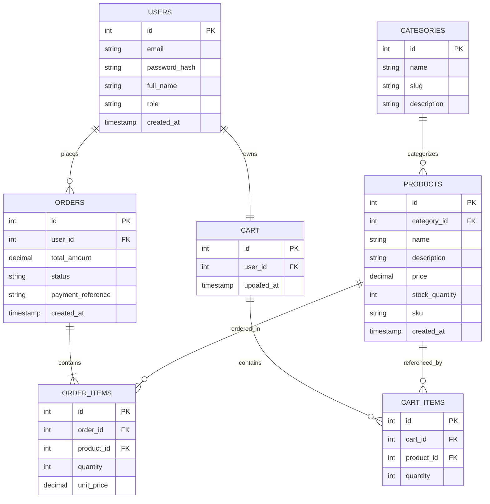

# Sprint 1: System Architecture & Scope Definition

**Course:** E-Commerce Software Development Life Cycle (SDLC)
**Document Version:** 1.0
**Status:** Complete

---

## Section 1: Target Audience & Market Focus

### Primary Persona
The platform targets **small-to-medium independent retail sellers** (e.g., boutique owners, small craft/apparel brands) who currently sell through informal channels (social media DMs, marketplaces with high commission fees) and need a self-owned storefront, alongside their end customers: **budget-conscious retail consumers aged 18–40** who shop primarily via mobile devices and expect fast search, transparent pricing, and a low-friction checkout.

### Core Pain Point
Small sellers lack an affordable, self-hosted platform that gives them full control over inventory, pricing, and order management without per-transaction marketplace fees or algorithmic deprioritization. Simultaneously, their customers struggle with inconsistent product discovery and unreliable cart/checkout experiences on ad hoc sales channels (e.g., items going out of stock without notice, no persistent cart across sessions).

### Domain Scope
**Vertical Market:** Apparel & Lifestyle Consumer Goods (clothing, accessories, and small lifestyle products).
The MVP is scoped to a **single-vendor, multi-customer** model (one storefront, many buyers) rather than a multi-vendor marketplace, to keep the system feasible within the academic semester while still exercising the full core commerce workflow (browse → cart → checkout → order → admin fulfillment).

---

## Section 2: MVP Feature Scope Matrix

| Category | Feature Name | Description | Priority |
|---|---|---|---|
| Authentication | User Registration & Authentication | Password hashing (bcrypt) and JWT-based authentication for session management, including login, signup, and token refresh. | High (MVP) |
| Catalog | Product List & Search | Product browsing interface with category-based (taxonomy) filtering, keyword search, and pagination. | High (MVP) |
| Cart | Cart Management | State-persistent cart tied to the user account, supporting item addition, quantity modification, and removal across sessions. | High (MVP) |
| Checkout | Order Processing | Mock or Stripe (test mode) payment gateway integration, with order object instantiation and confirmation on success. | High (MVP) |
| Admin | Inventory Control | Administrative CRUD operations for product inventory: create/update/delete products, adjust stock, manage categories. | Medium |
| Orders | Order History & Status Tracking | Customer-facing view of past orders with status (Pending, Paid, Shipped, Cancelled), and an admin view to update order status. | Medium |

**Feasibility note:** The six workflows above map directly to the six required entities (Users, Products, Categories, Orders, Order_Items, Cart/Cart_Items), so no entity in the schema is orphaned from an actual user-facing feature — this keeps scope and data model tightly aligned for a one-semester build.

---

## Section 3: Tech Stack Selection & Justification

### Frontend Framework: **React (with Vite)**
**Justification:** React's component model maps naturally onto reusable commerce UI (product cards, cart drawer, checkout steps), and its large ecosystem (React Router, React Query) reduces the amount of boilerplate the team needs to write from scratch. Vite is chosen over Create React App for faster dev-server startup and hot-module-reload, which matters for a time-boxed academic sprint cycle.

### Backend Infrastructure: **Node.js / Express**
**Justification:** Express keeps the backend lightweight and unopinionated, which suits a small team building a bounded MVP rather than an enterprise-scale system. Using JavaScript/TypeScript across both frontend and backend reduces context-switching for the team and simplifies shared type definitions (e.g., for the Product and Order shapes) compared to introducing a second language like Python (Django/FastAPI) or Java (Spring Boot).

### Database Management System: **PostgreSQL**
**Justification:** The domain is fundamentally relational — orders reference users and products, order items associate orders with products, and cart items associate carts with products — so a relational database with strong foreign-key and transactional (ACID) guarantees is a better fit than a document store like MongoDB, particularly for preventing double-charging or lost-stock-update bugs during checkout.

### Caching & Asynchronous Processing (Optional): **Redis**
**Justification:** Redis is used for two lightweight roles: caching frequently-read product list/search queries to reduce repeated PostgreSQL load, and optionally backing session/JWT-blacklist storage for logout handling. It is treated as optional infrastructure — the MVP is fully functional without it — but included for scalability of the read-heavy catalog endpoints.

---

## Section 4: Entity-Relationship Diagram (ERD)

### Cardinality Summary
- **Users → Orders:** 1:N (a user places many orders; an order belongs to one user)
- **Users → Cart:** 1:1 (each user has exactly one active cart)
- **Orders → Order_Items:** 1:N (an order contains many order items)
- **Products → Order_Items:** 1:N (a product can appear in many order items across different orders)
- **Cart → Cart_Items:** 1:N (a cart contains many cart items)
- **Products → Cart_Items:** 1:N (a product can appear in many carts)
- **Categories → Products:** 1:N (a category groups many products; each product belongs to one category)

### Mermaid ERD

### Key & Constraint Notes
| Entity | Primary Key | Foreign Keys | Notes |
|---|---|---|---|
| USERS | `id` | — | `email` UNIQUE, NOT NULL |
| CATEGORIES | `id` | — | `slug` UNIQUE |
| PRODUCTS | `id` | `category_id → CATEGORIES.id` | `stock_quantity >= 0` (CHECK constraint) |
| ORDERS | `id` | `user_id → USERS.id` | `status` ENUM: `pending, paid, shipped, cancelled` |
| ORDER_ITEMS | `id` | `order_id → ORDERS.id`, `product_id → PRODUCTS.id` | `unit_price` snapshotted at time of purchase (not a live FK-derived value), to preserve historical accuracy if product price later changes |
| CART | `id` | `user_id → USERS.id` (UNIQUE, enforcing 1:1) | One cart per user |
| CART_ITEMS | `id` | `cart_id → CART.id`, `product_id → PRODUCTS.id` | Composite UNIQUE (`cart_id`, `product_id`) to prevent duplicate rows for the same product |

---

## 5. Submission Checklist (per assignment guidelines)
- [ ] Repository initialized with instructor/TA granted collaborator access
- [ ] This file committed as `/docs/SPRINT_1.md`
- [ ] Repository URL submitted to the LMS before the deadline
